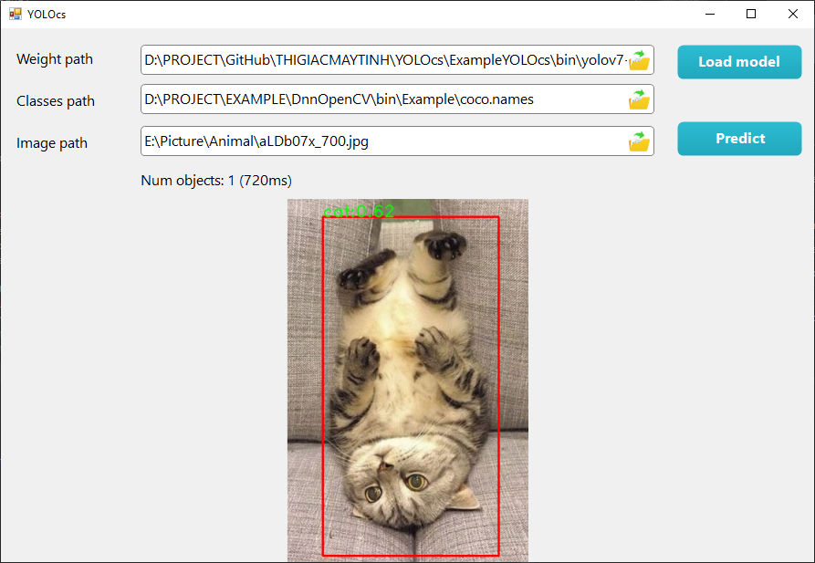

# YOLOcs
Tích hợp YOLOv7 vào WinForm C# sử dụng OpenCV

### Bước 1: convert yolov7.pt thành yolov7.onnx
Vào folder yolov7-u5, đọc và làm theo file readme để convert file

### Bước 2: build Example_YOLOv7_cs_CV480_x64.sln 
Cài đặt Visual Studio 2017 trở lên và phải cài đặt C++ Development.

Sau đó vào folder ExampleYOLOcs, build Example_YOLOv7_cs_CV480_x64.sln , lưu ý chỉ có mode x64.

### Bước 3: load file onnx và names
Trong folder ExampleYOLOcs\bin có commit sẵn 2 file:
- yolov7-tiny.onnx convert từ yolov7-tiny.pt
- coco.names chứa 80 class CoCo

Load 2 file onnx và names, sau đó chọn ảnh để predict.

## Giải thích source code

Module DLL được đóng gói sẵn với giải thuật được viết bằng OpenCV DNN C++. Đây là example, dùng cho các bạn test nhanh hoặc test các model tiny, muốn nhanh thì phải build bản GPU (vui lòng liên hệ phone/zalo 0939.825.125).

Các bạn cần khởi tạo biến YOLOcs, sau đó load 2 file onnx và file names (chứa các class). Khi predict 1 hình ảnh bạn sẽ được YOLOresult, object này có:
- Danh sách các object, mỗi object có rectangle, class ID và class name.
- Ảnh bitmap kết quả
- Thời gian thực thi

Source code có sử dụng background worker để detect ở 1 thread riêng do thời gian thực thi lâu. Đây cũng là 1 ví dụ dễ hiểu về background thread mà các bạn sinh viên nên áp dụng nếu có những function thực thi lâu.

Bài viết chi tiết: https://thigiacmaytinh.com/huong-dan-detect-object-bang-yolov7-tren-windows-form-c